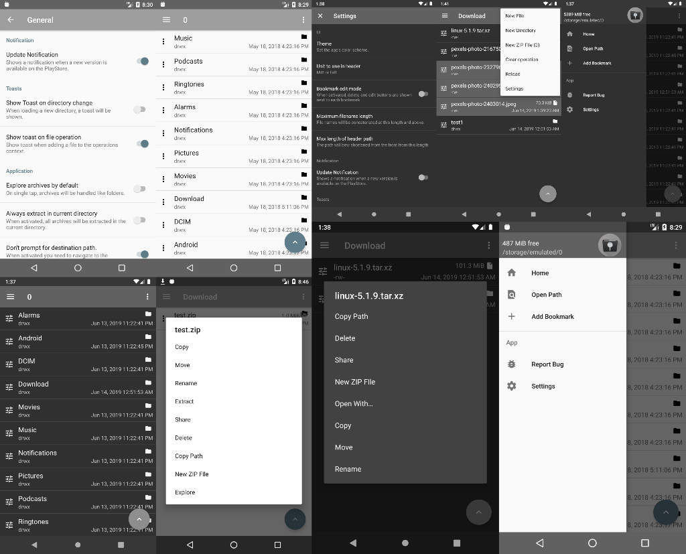

# lrkFM

File manager for Android. It has the following features:

- set the directory the app starts in
- full access to filesystem (if permissions are right)
- can create zip archives
- can extract zip, rar, 7zip, tar, tar.gz archives
- can explore some of the above archives (archives in archives don't work)
- file operations (move and so on)
- shows free space on filesystem
- add bookmarks to the sidebar
- share files from app
- ad free
- open source

You can join the beta program through [here.](https://play.google.com/apps/testing/io.lerk.lrkfm)

## Usage

### Permissions

Obviously this app needs full access to the filesystem to work. This is checked and prompted if needed when starting the app.
The app also needs internet access to check for updates if this feature is enabled in the settings.

## Screenshots

**Please note:** This project was moved from my personal GitLab instance to GitHub. Issue mentions in commits might be misleading!

Logo generated by Ander Méndez.

Google Play and the Google Play logo are trademarks of Google Inc.
