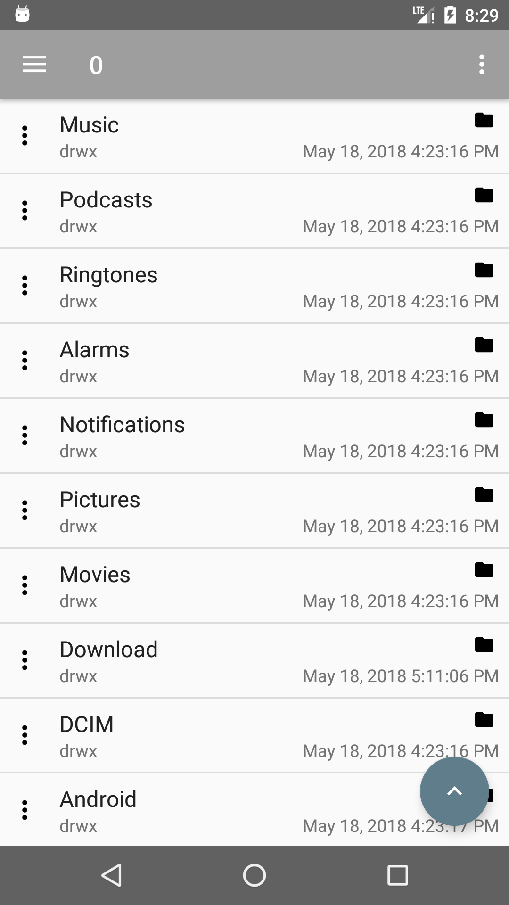
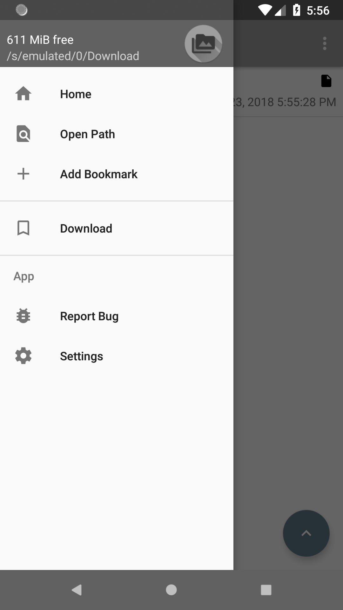
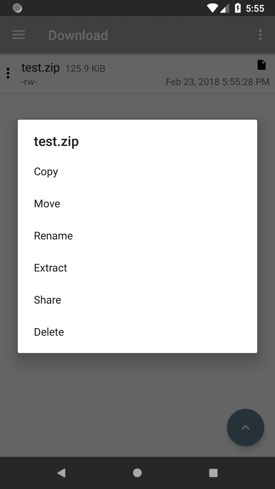
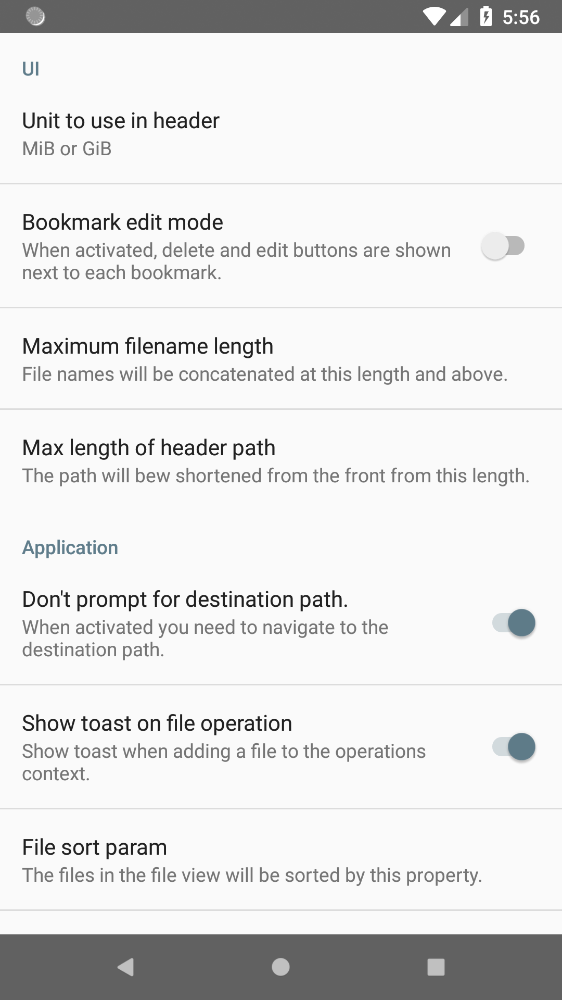

# lrkFM

File manager for Android. It has the following features:

- set the directory the app starts in
- full access to filesystem (if permissions are right)
- can extract zip and rar archives
- file operations (move and so on)
- shows free space on filesystem
- add bookmarks to the sidebar
- share files from app
- ad free
- open source

## Screenshots

You can join the beta program through [here.](https://play.google.com/apps/testing/io.lerk.lrkfm)

**Please note:** This project was moved from my personal GitLab instance to GitHub. Issue mentions in commits might be misleading!

Logo generated with software by [Philipp Eichhorn](https://android-material-icon-generator.bitdroid.de)

Google Play and the Google Play logo are trademarks of Google Inc.